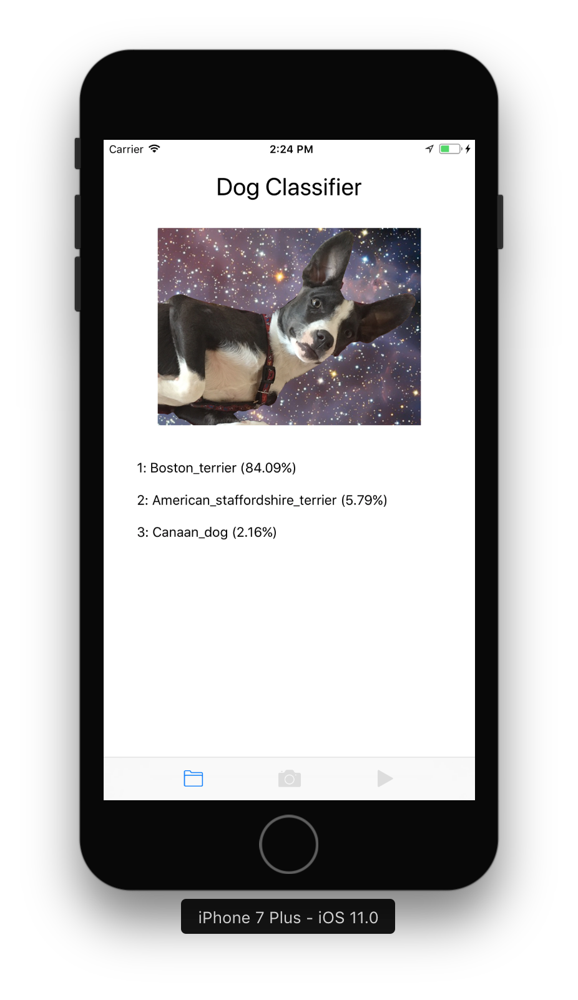

# Dog Classifier iOS App

This iOS app uses [CoreML](https://developer.apple.com/machine-learning/) and a neural network classifier built by James Requa, a graduate from Udacity's Deep Learning Nanodegree Foundation program, and it can detect a dog and determine its breed from an image or live video.

> **Note**: You must use Xcode 9 (supports iOS 11) to build this app.

## Structure

- iOS/
	- Contains Xcode project for iOS application
- ML/
	- images/
		- Test images to use for classification
	- models/
		- Keras and Core ML models
	- scripts/
		- Python scripts for creating and testing models

## Requirements

- To run the iOS project, you must use Xcode 9
- To run any of the Python scripts, use the `coreml-environment.yml` file to create a [Anaconda environment](https://conda.io/docs/using/envs.html) with the correct dependencies
- To run the Python script which generates a Core ML (.mlmodel) model, you must be running macOS 10.13 (High Sierra)

> **Note**: Apple software can be downloaded from [Apple's download page](https://developer.apple.com/download/).

## How it Works

The iOS app relies on two neural networks — Resnet50 and StudentDogModel (the dog classifier). When an image or video frame is processed by the app, it first goes through the Resnet50 model to determine if a dog is present. If a dog is present, then a second classification is done using the StudentDogModel to determine the dog's breed.
